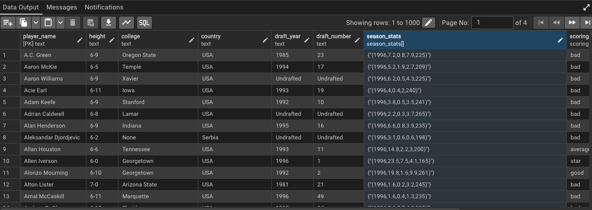

# Cumulative_Table_Design
Data Modeling  your data in cumulative fashion which would help aggregate data over time, typically at a specific grain()daily, weekly, yearly, etc). It is designed to optimize performance for analytical queries that require pre-aggregated data, such as trends or summaries over time.

# **Cumulative Table Design for Player Statistics**

## **Overview** 🏀

This project demonstrates a **cumulative table design (CTD)** for tracking player statistics across seasons using PostgreSQL. The design maintains historical data while incrementally updating the cumulative table with new season data. This approach optimizes performance, reduces computational costs, and ensures consistency across projects.

The key features include:
- Use of **custom data types** for structured storage.
- **Arrays** to store historical data efficiently.
- Incremental updates to append new season data while preserving history.
- Querying trends and improvements without expensive operations like `GROUP BY`.

---

## **Table of Contents** 📚

- [Cumulative\_Table\_Design](#cumulative_table_design)
- [**Cumulative Table Design for Player Statistics**](#cumulative-table-design-for-player-statistics)
  - [**Overview** 🏀](#overview-)
  - [**Table of Contents** 📚](#table-of-contents-)
  - [**Key Features** ✨](#key-features-)
  - [**Schema Design** 🏗️](#schema-design-️)
    - [1. **Custom Data Types**](#1-custom-data-types)
    - [**Cumulative Table Logic**](#cumulative-table-logic)
    - [1. **Incremental Updates 🔄**](#1-incremental-updates-)
    - [**Key Query**](#key-query)
    - [**Explanation**](#explanation)
    - [2. **Unnesting Arrays** 🧩](#2-unnesting-arrays-)
    - [**Explanation**](#explanation-1)
  - [**Conclusion** 🎯](#conclusion-)
    - [**Importance of Cumulative Tables in Data Modeling** 📊](#importance-of-cumulative-tables-in-data-modeling-)
    - [**Effectiveness of Cumulative Tables** 🚀](#effectiveness-of-cumulative-tables-)
    - [**Pre-Aggregation: How to Achieve It** ⚙️](#pre-aggregation-how-to-achieve-it-️)
    - [**Advantages of Cumulative Tables** ✅](#advantages-of-cumulative-tables-)
    - [**Disadvantages of Cumulative Tables** ❌](#disadvantages-of-cumulative-tables-)
    - [**Final Thoughts** 💡](#final-thoughts-)


---

## **Key Features** ✨

1. **Custom Data Types**:
   - `season_stats`: A structured type (`STRUCT`) for storing season-specific metrics like points, assists, rebounds, and weight.
   - `scoring_class`: An ENUM type to classify players based on performance (e.g., 'star', 'good').

2. **Incremental Updates**:
   - Combines new season data with historical data using `FULL OUTER JOIN` to ensure all players are included.

3. **Efficient Querying**:
   - Historical data is stored as arrays, enabling fast queries without the need for costly operations like `GROUP BY`.

4. **Historical Analysis**:
   - Supports trend analysis, improvement calculations, and performance categorization over multiple seasons.

---

## **Schema Design** 🏗️

### 1. **Custom Data Types**
```sql
CREATE TYPE season_stats AS (
    season INTEGER,
    pts REAL,
    ast REAL,
    reb REAL,
    weight INTEGER
);
```
```sql
CREATE TYPE scoring_class AS ENUM ('star', 'good', 'average', 'bad');
```


•	`season_stats`: Stores structured metrics for each season.

•	`scoring_class`: Categorizes players based on their performance.

```sql
CREATE TABLE players (
    player_name TEXT,
    height TEXT,
    college TEXT,
    country TEXT,
    draft_year TEXT,
    draft_number TEXT,
    season_stats season_stats[], -- Array of structured season stats
    scoring_class scoring_class, -- Performance category
    years_since_last_season INTEGER, -- Tracks inactivity
    current_season INTEGER, -- Current season being tracked
    PRIMARY KEY (player_name, current_season) -- Composite primary key
);
```

### **Cumulative Table Logic**

### 1. **Incremental Updates 🔄**

The cumulative table is updated incrementally by combining:
- **Yesterday’s Data**: Historical records from the previous season.
- **Today’s Data**: New records for the current season.

### **Key Query**
```sql
INSERT INTO players
WITH yesterday AS (
    SELECT * FROM players WHERE current_season = 2000
),
today AS (
    SELECT * FROM player_seasons WHERE season = 2001
)
SELECT 
    COALESCE(t.player_name, y.player_name) AS player_name,
    COALESCE(t.height, y.height) AS height,
    COALESCE(t.college, y.college) AS college,
    COALESCE(t.country, y.country) AS country,
    COALESCE(t.draft_year, y.draft_year) AS draft_year,
    COALESCE(t.draft_number, y.draft_number) AS draft_number,

    CASE 
        WHEN y.season_stats IS NULL THEN ARRAY[
            ROW(t.season, t.pts, t.ast, t.reb, t.weight)::season_stats
        ]
        WHEN t.season IS NOT NULL THEN y.season_stats || ARRAY[
            ROW(t.season, t.pts, t.ast, t.reb, t.weight)::season_stats
        ]
        ELSE y.season_stats
    END AS season_stats,

    CASE 
        WHEN t.season IS NOT NULL THEN 
            CASE 
                WHEN t.pts > 20 THEN 'star'
                WHEN t.pts > 15 THEN 'good'
                WHEN t.pts > 10 THEN 'average'
                ELSE 'bad'
            END::scoring_class
        ELSE y.scoring_class
    END AS scoring_class,

    CASE 
        WHEN t.season IS NOT NULL THEN 0
        ELSE y.years_since_last_season + 1
    END AS years_since_last_season,

    COALESCE(t.season, y.current_season + 1) AS current_season

FROM today t 
FULL OUTER JOIN yesterday y 
ON t.player_name = y.player_name;
```

### **Explanation**
- **Combines new (`today`) and old (`yesterday`) data** using a `FULL OUTER JOIN` to ensure all players are included:
  - If a player exists in `yesterday` but not in `today`, their historical data is retained.
  - If a player exists in `today` but not in `yesterday`, they are added as a new entry.
- **Updates the `season_stats` array**:
  - Appends the current season’s stats to the existing array using `||` (array concatenation).
  - If no historical data exists (`y.season_stats IS NULL`), initializes the array with today’s stats.
- **Classifies players into performance categories (`scoring_class`)**:
  - Based on points scored (`pts`), players are categorized as `'star'`, `'good'`, `'average'`, or `'bad'`.
- **Tracks inactivity using `years_since_last_season`**:
  - Resets to `0` if a player is active in the current season.
  - Increments by `1` if a player is inactive.

### 2. **Unnesting Arrays** 🧩
To analyze historical data in a flattened format:
```sql
WITH unnested AS (
    SELECT player_name,
           UNNEST(season_stats)::season_stats AS season_stats
    FROM players 
    WHERE current_season = 2001 AND player_name = 'Michael Jordan'
)
SELECT player_name, (season_stats::season_stats).* FROM unnested;

```

### **Explanation**
- **Unnesting** :
	- The `UNNEST()` function expands the `season_stats` array into individual rows.
- **Flattening Structs**:
	- The `(season_stats::season_stats).*` syntax extracts fields from the `season_stats` struct into separate columns (e.g., `season`, `pts`, `ast`, etc.).
	- This query allows for detailed analysis of each season’s statistics for a specific player (e.g., Michael Jordan).

Below is a visual representation of the cumulative table design, showcasing how historical data is stored and updated incrementally:



> **Path to the image**: `/Users/vivekhanagoji/Documents/DataEngineer_BootCamp/Lab_Files/Season_stats_cumulative.png`

This image illustrates the structure of the cumulative table, including:
- The use of arrays to store historical data.
- How incremental updates append new season statistics while preserving past records.
- The overall design that supports efficient querying and analytics.

## **Conclusion** 🎯

### **Importance of Cumulative Tables in Data Modeling** 📊
Cumulative tables are a cornerstone of efficient data modeling, enabling seamless tracking of historical data while supporting incremental updates. They allow organizations to:
- **Monitor trends** over time with ease.
- **Perform advanced analytics** by combining past and present data.
- **Optimize performance** for large datasets by reducing query complexity.

By pre-aggregating data into cumulative snapshots, cumulative tables ensure faster query execution and reduced computational overhead, making them indispensable for high-performance analytics.

---

### **Effectiveness of Cumulative Tables** 🚀
Cumulative table design is highly effective for:
- **Reducing Query Complexity**: Pre-aggregated data eliminates the need for repetitive joins or complex aggregations during query execution.
- **Improving Query Performance**: Arrays and pre-computed metrics enable faster retrieval of insights, even for large datasets.
- **Maintaining Historical Data**: Historical records are preserved while allowing incremental updates, ensuring data integrity over time.

---

### **Pre-Aggregation: How to Achieve It** ⚙️
Pre-aggregation involves summarizing raw data into meaningful metrics at predefined intervals (e.g., daily, weekly, monthly). This process simplifies querying and improves performance. Steps to achieve pre-aggregation include:
1. **Define the Grain**: Decide the level of detail (e.g., one row per user per day).
2. **Build Daily Metrics Tables**: Aggregate raw events into daily summaries using SQL functions like `SUM()` or `COUNT()`.
3. **Incremental Updates**: Use techniques like `FULL OUTER JOIN` to combine new data with historical records incrementally.
4. **Use Arrays for Efficiency**: Store historical metrics in arrays to enable fast calculations for different timeframes (e.g., last 7 days or 30 days).
5. **Automate Pipelines**: Tools like Airflow or dbt can automate the process of updating cumulative tables regularly.

---

### **Advantages of Cumulative Tables** ✅
1. **Performance Optimization**:
   - Reduces I/O and compute costs by avoiding repeated aggregations.
   - Enables faster queries by leveraging pre-computed metrics.
2. **Scalability**:
   - Handles large datasets effectively by summarizing raw data into manageable snapshots.
3. **Historical Insights**:
   - Preserves historical data for trend analysis and comparisons over time.
4. **Flexibility in Analysis**:
   - Supports dynamic queries (e.g., last 7 days, last month) using array slicing or aggregation functions.

---

### **Disadvantages of Cumulative Tables** ❌
1. **Storage Overhead**:
   - Storing pre-aggregated snapshots can consume more storage compared to raw data, especially when arrays grow large.
2. **Complexity in Updates**:
   - Incremental updates require careful implementation to ensure consistency and avoid duplication.
3. **Loss of Granularity**:
   - Pre-aggregated data may lack the fine-grained detail available in raw datasets, limiting certain types of analysis.
4. **Maintenance Effort**:
   - Requires regular updates through automated pipelines or manual intervention.

---

### **Final Thoughts** 💡
Cumulative table design is a powerful modeling technique that balances performance, scalability, and historical accuracy. While it introduces some complexity in terms of storage and maintenance, its benefits far outweigh the drawbacks for most analytical workloads. By leveraging pre-aggregation and incremental updates effectively:
- Organizations can unlock faster insights 🔍,
- Reduce costs 💰,
- And maintain a consistent approach to data modeling across teams 🤝.

This makes cumulative tables an essential tool for any modern data engineering or analytics pipeline! 🎉


